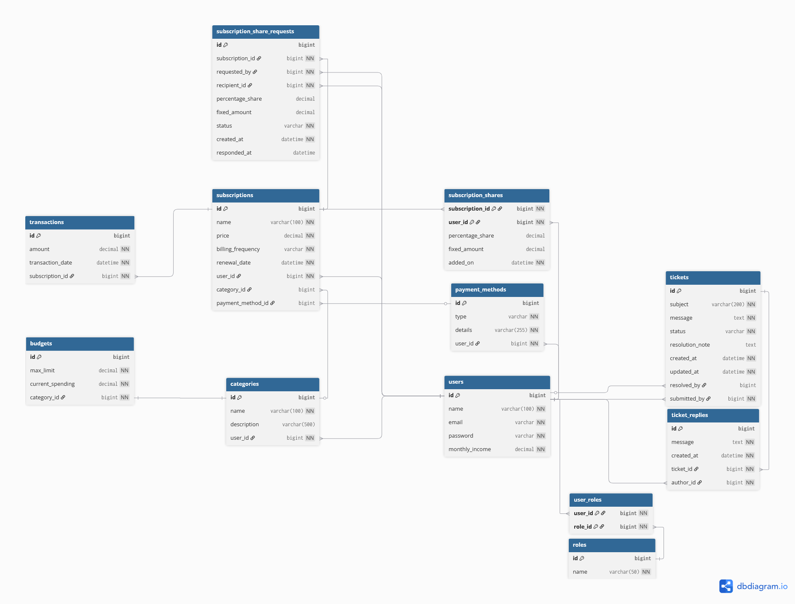

# Personal Finance & Subscription Tracker

A Spring Boot microservices application that helps individuals and families manage recurring subscriptions, track expenses by category, and monitor their financial health. Users centralize subscriptions across different services (like Netflix, Spotify, cloud storage, etc.), set spending budgets per category, share subscription costs with other users, and gain insight into their disposable income and upcoming payment obligations.

---

## Project Description

The platform turns the messy reality of household subscriptions into a single and straight forward view. The main capabilities are:

- **User profile & income management**: register, log in, maintain monthly income as the baseline for financial calculations.
- **Subscription lifecycle**: full CRUD over recurring subscriptions, with different billing frequencies, renewal date tracking, and automatic monthly-equivalent normalization.
- **Subscription sharing**: cost split between users, by either percentage or fixed amount, aided by a request/accept/decline workflow.
- **Categories & budgets**: custom categories with per-category spending limits; current spending is recomputed automatically when subscriptions are added, edited, or deleted.
- **Payment methods & transactions**: register payment methods, link each subscription to one, and keep an immutable transaction history.
- **Financial dashboard**: disposable income, upcoming renewals (next 7 days), and per-category breakdowns.
- **Support tickets**: per-user ticket submission with admin triage (`OPEN -> IN_PROGRESS -> RESOLVED`), threaded replies, and a dedicated admin console.
- **Authentication & authorization**: Spring Security with `ROLE_USER` / `ROLE_ADMIN`, BCrypt password hashing, remember-me, CSRF protection, and a custom login page.

Full functional requirements are documented in [Functional_Requirements.md](Functional_Requirements.md).

---

## Microservices Architecture

The original monolithic implementation is kept in `FinanceTracker/` for reference, while the current optional microservices implementation is split into three independently built Spring Boot services:

| Service | Port | Responsibility |
|---|---:|---|
| `user-service` | `8080` | Authentication, users, roles, support tickets, Thymeleaf UI, and internal user lookup endpoints |
| `finance-core-service` | `8081` | Core finance domain: categories, budgets, payment methods, subscriptions, sharing, and transactions |
| `reporting-service` | `8082` | Dashboard/reporting calculations: disposable income, renewal summaries, and category spending |

The root `docker-compose.yml` starts all three services plus their backing databases:

- `user-db`: MySQL database for users, roles, and support tickets.
- `finance-core-db`: MySQL database for finance-core entities.
- `reporting-service`: stateless service that reads data from `user-service` and `finance-core-service`.

Service communication is implemented over REST with Spring `RestClient`:

- `user-service` calls `finance-core-service` for finance CRUD screens.
- `user-service` calls `reporting-service` for the dashboard.
- `finance-core-service` calls `user-service` internal endpoints to validate users and resolve share recipients.
- `reporting-service` calls both `user-service` and `finance-core-service` to assemble dashboard reports.

Each service has its own `Dockerfile`, profile-specific configuration files (`application-dev.yml`, `application-test.yml`, `application-docker.yml`), and can be built separately with its Maven wrapper. In Docker, service URLs use Compose DNS names such as `http://finance-core-service:8081`; in local development, they use `localhost` ports.

This satisfies the baseline optional requirement of migrating the monolith to at least three independent microservices. The current implementation uses direct configured REST URLs; service discovery, API gateway, distributed JWT security, resilience, and observability are listed as optional extension points.

---

## Monitoring

All three microservices expose basic Spring Boot Actuator endpoints:

| Service | Health | Info | Metrics |
|---|---|---|---|
| `user-service` | `http://localhost:8080/actuator/health` | `http://localhost:8080/actuator/info` | `http://localhost:8080/actuator/metrics` |
| `finance-core-service` | `http://localhost:8081/actuator/health` | `http://localhost:8081/actuator/info` | `http://localhost:8081/actuator/metrics` |
| `reporting-service` | `http://localhost:8082/actuator/health` | `http://localhost:8082/actuator/info` | `http://localhost:8082/actuator/metrics` |

Prometheus-format metrics are also exposed for scraping:

- `user-service`: `http://localhost:8080/actuator/prometheus`
- `finance-core-service`: `http://localhost:8081/actuator/prometheus`
- `reporting-service`: `http://localhost:8082/actuator/prometheus`

The Docker Compose stack also starts Prometheus at `http://localhost:9090`. Its scrape configuration is stored in `monitoring/prometheus/prometheus.yml` and collects metrics from all three microservices through Docker Compose DNS names.

Grafana is available at `http://localhost:3000` with default credentials `admin` / `admin`. The Prometheus datasource is provisioned automatically from `monitoring/grafana/provisioning/datasources/prometheus.yml`, and the Finance Tracker monitoring dashboard is loaded from `monitoring/grafana/dashboards/finance-tracker-microservices.json`.

For `user-service`, public access is allowed for `health`, `info`, and `prometheus`; the rest of `/actuator/**` requires an admin session. The backend-only services currently expose their Actuator endpoints directly because they are intended to run inside the Docker Compose network during the microservices demo.

---

## CI/CD Pipeline

The repository includes a GitHub Actions workflow in `.github/workflows/ci.yml`.

On pushes and pull requests for `main`, `dev`, and `microservices-migration`, the pipeline:

- runs the monolith test suite from `FinanceTracker/`
- runs the `user-service` test suite
- runs the `finance-core-service` test suite
- runs the `reporting-service` test suite
- builds the Docker Compose microservices stack after tests pass

This covers automated build validation, automated test execution, and Docker containerization validation. A staging deployment job can be added later by extending the same workflow with a deploy hook or SSH-based Docker Compose deployment.

---

## ER Diagram

The diagram below was generated from [docs/database/schema.dbml](docs/database/schema.dbml) using [dbdiagram.io](https://dbdiagram.io).



**12 entities, all required relationship types covered:**

- **`@OneToOne`**: `Budget` <-> `Category`
- **`@OneToMany` / `@ManyToOne`**: `User` -> `Subscription`, `User` -> `Category`, `User` -> `PaymentMethod`, `Subscription` -> `Transaction`, `Subscription` -> `Category`, `Subscription` -> `PaymentMethod`, `Ticket` -> `TicketReply`, etc.
- **`@ManyToMany`** — `User` <<->> `Role` (via `user_roles`); `User` <<->> `Subscription` (via `subscription_shares` with extra columns)

---

## Setup Instructions

### Prerequisites

- JDK 25 (or any JDK 21+; adjust `JAVA_HOME` accordingly)
- MySQL 8.x running on `localhost:3306` with database `financetracker`, user `root`, password `root` (override via env vars or `application-dev.yml`)
- Maven wrapper (bundled and no global Maven needed)

### Run the Monolith Locally (dev profile, MySQL)

PowerShell:
```powershell
$env:JAVA_HOME = "C:\Users\<you>\.jdks\openjdk-25.0.2"
$env:PATH = "$env:JAVA_HOME\bin;$env:PATH"
Set-Location "FinanceTracker"
.\mvnw.cmd spring-boot:run "-Dspring-boot.run.profiles=dev"
```

The monolith listens on `http://localhost:8080`. Default seeded admin credentials (created by `DataInitializer`):

- **Email:** `admin@financetracker.com`
- **Password:** `admin123`

### Run Monolith Tests (test profile, H2 in-memory)

```powershell
Set-Location "FinanceTracker"
.\mvnw.cmd test "-Dspring.profiles.active=test"
```

To produce the JaCoCo coverage report:

```powershell
.\mvnw.cmd verify
```

Open `FinanceTracker/target/site/jacoco/index.html` for the HTML coverage report.

### Run Microservice Tests

Each microservice can be tested independently with its own Maven wrapper and the `test` Spring profile.

PowerShell:
```powershell
Set-Location "user-service"
.\mvnw.cmd test "-Dspring.profiles.active=test"

Set-Location "..\finance-core-service"
.\mvnw.cmd test "-Dspring.profiles.active=test"

Set-Location "..\reporting-service"
.\mvnw.cmd test "-Dspring.profiles.active=test"
```

To run coverage reports, replace `test` with `verify` in each service. The JaCoCo report is generated under each service's `target/site/jacoco/index.html`.

### Run Microservices with Docker

```powershell
Set-Location "<repo-root>"
docker compose up --build
```

This starts:

- `user-service`: `http://localhost:8080`
- `finance-core-service`: `http://localhost:8081`
- `reporting-service`: `http://localhost:8082`
- `prometheus`: `http://localhost:9090`
- `grafana`: `http://localhost:3000`
- `user-db`: MySQL exposed on `localhost:3307`
- `finance-core-db`: MySQL exposed on `localhost:3308`

The UI is served by `user-service` at `http://localhost:8080`.

---

## Screenshots

> _To be added_
