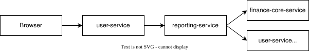

# Backend-for-Frontend pattern

This document explains how the Personal Finance and Subscription Tracker uses the Backend-for-Frontend pattern in the microservices version of the project.

## Pattern overview

The Backend-for-Frontend pattern adds a backend layer that is tailored to one frontend experience. Instead of making the browser call every backend service directly, the frontend talks to one service that understands its screens, session rules, form flow, and data needs.

In this project, `user-service` plays that role. It is both the web entry point and the browser-specific backend. The other services stay focused on backend APIs and domain logic.

## Why this pattern was chosen

The application uses a Thymeleaf web interface, not a separate JavaScript frontend. That means the browser needs rendered pages, form binding, validation errors, pagination state, redirect messages, and authenticated session handling.

Those concerns do not belong in `finance-core-service` or `reporting-service`. Those services should not know how the subscription form is rendered, how the dashboard template is filled, or how Spring Security sessions are handled for the browser.

The BFF pattern fits because `user-service` can handle the web-specific work while delegating finance and reporting logic to the services that own those domains.

## How the pattern is applied

`user-service` is the only browser-facing service in the microservices stack. It listens on port `8080` and serves the Thymeleaf UI.

The browser interacts with routes such as:

| Browser route | Handled by | Backend service used |
|---|---|---|
| `/dashboard` | `FinanceDashboardController` | `reporting-service` |
| `/subscriptions` | `SubscriptionViewController` | `finance-core-service` |
| `/categories` | `CategoryViewController` | `finance-core-service` |
| `/budgets` | `BudgetViewController` | `finance-core-service` |
| `/payment-methods` | `PaymentMethodViewController` | `finance-core-service` |
| `/transactions` | `TransactionViewController` | `finance-core-service` |
| `/contact` and admin ticket pages | `ContactController`, `AdminTicketController` | local `user-service` data |

The backend services expose APIs. `user-service` decides how those API responses are presented to the web user.

## Request flow

A typical finance page follows this flow:

For example, the subscription list page is handled by `SubscriptionViewController`. The controller reads the authenticated user, calls `FinanceCoreClient.getSubscriptions(...)`, adds pagination and sorting values to the model, and returns the `subscriptions/list` Thymeleaf template.

The browser never needs to know the URL or DTO shape of `finance-core-service`.

The dashboard has a similar flow:

`FinanceDashboardController` calls `ReportingClient.getDashboard(...)`. The reporting service assembles dashboard data, then `user-service` places the values into the Thymeleaf model for `finance/dashboard`.

## BFF responsibilities in this project

`user-service` is responsible for web-facing behavior:

- serving Thymeleaf templates
- handling login, logout, sessions, CSRF, and role-based access
- reading the current authenticated user
- mapping form objects to backend DTOs
- adding dropdown data such as categories and payment methods
- preserving pagination, sorting, and selected values for the UI
- adapting backend responses into model attributes
- showing success and error messages after form submissions

`finance-core-service` and `reporting-service` do not render pages and do not manage browser sessions. They expose backend APIs.

## Code evidence

The pattern can be seen in these files:

| File | Role in the BFF pattern |
|---|---|
| `user-service/.../FinanceDashboardController.java` | Handles the browser dashboard and calls `reporting-service` |
| `user-service/.../SubscriptionViewController.java` | Handles subscription pages and calls `finance-core-service` |
| `user-service/.../FinanceCoreClient.java` | REST client used by the BFF to call finance APIs |
| `user-service/.../ReportingClient.java` | REST client used by the BFF to call reporting APIs |
| `user-service/src/main/resources/templates/` | Thymeleaf templates rendered by the BFF |
| `finance-core-service/src/main/java/com/awbd/financetracker/controllers/` | Backend API controllers for finance data |
| `reporting-service/.../ReportingController.java` | Backend API controller for dashboard reports |

This structure keeps the UI flow in one place and avoids spreading web concerns across the backend services.

## Why it helps

The BFF pattern makes the microservices split easier for the frontend. The browser still has one main application entry point: `http://localhost:8080`.

It also keeps the backend services cleaner. `finance-core-service` owns finance operations. `reporting-service` owns reporting calculations. `user-service` owns the web experience and coordinates calls when a page needs data from more than one service.

This matters most on pages like the dashboard and subscription form. The dashboard needs reporting values, upcoming renewals, and category spending. The subscription form needs categories, payment methods, billing frequencies, validation results, and redirect messages. A BFF is a natural place to combine that data for the screen.

## Repository evidence

The pattern is visible in the repository structure:

| Path | Meaning |
|---|---|
| `user-service/` | Browser-facing BFF, authentication service, and Thymeleaf UI host |
| `user-service/src/main/resources/templates/` | Web templates served by the BFF |
| `user-service/src/main/java/com/awbd/financetracker/client/` | REST clients used to call backend services |
| `finance-core-service/` | Backend finance domain API |
| `reporting-service/` | Backend reporting API |
| `docker-compose.yml` | Runs the BFF and backend services together |

Together, these files show the Backend-for-Frontend pattern: the frontend talks to `user-service`, and `user-service` coordinates the backend services needed by each web page.
